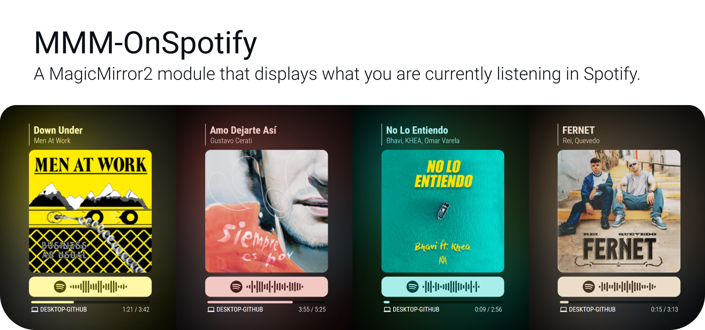
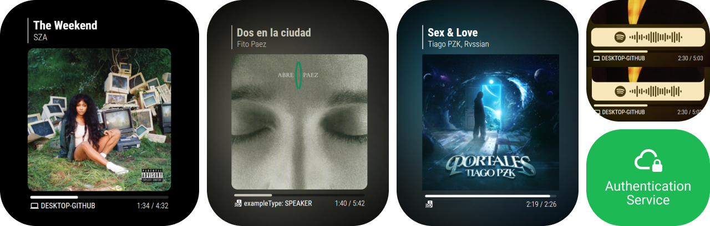
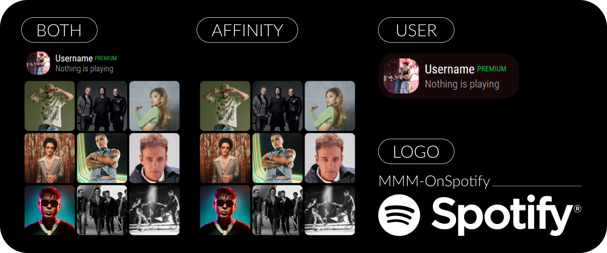
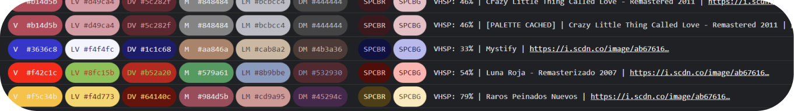
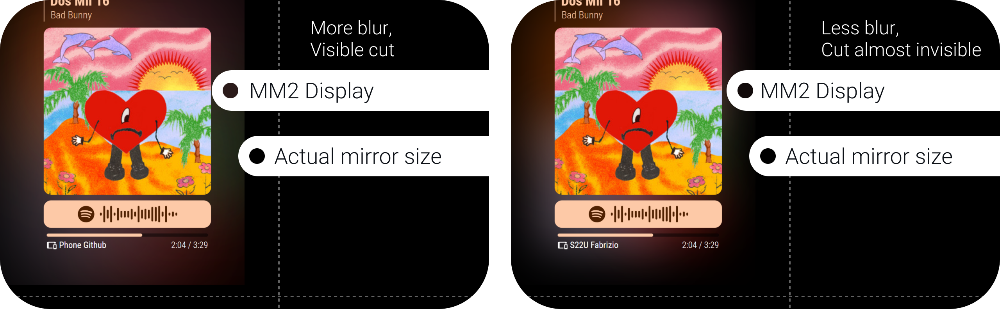
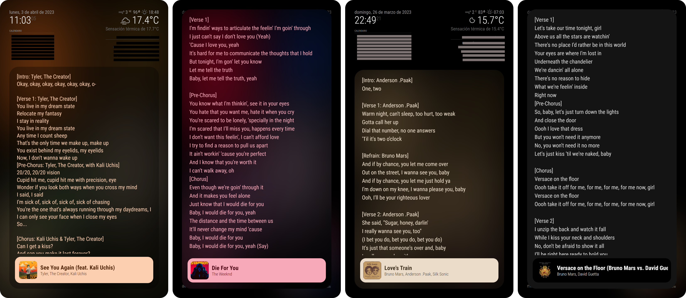
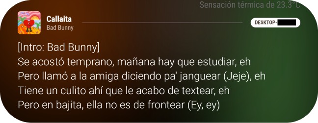
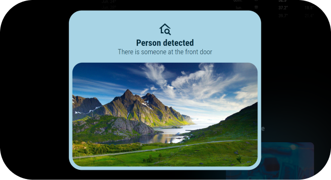
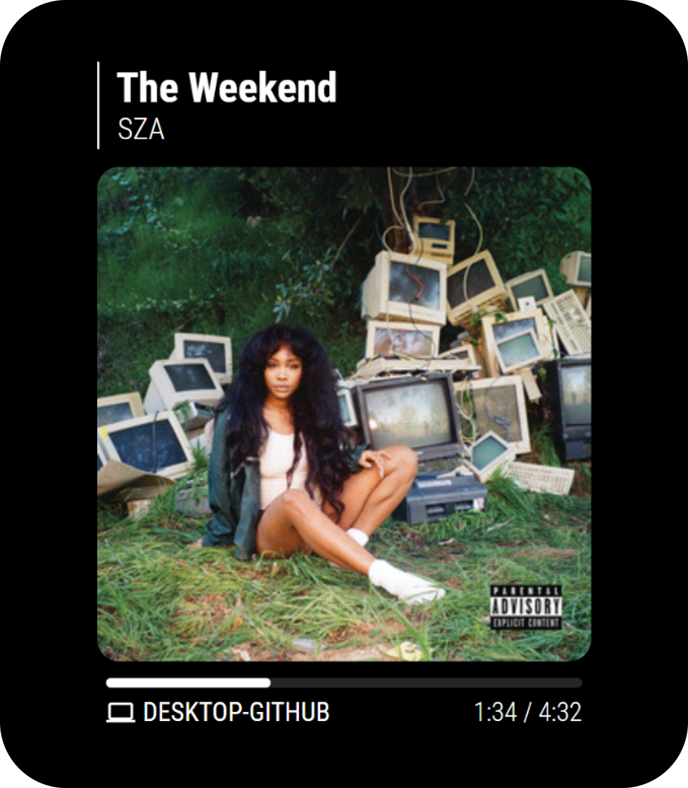

[](https://fabriz.co/)

# 

### 

### 

## How does it work?
This module shows what you are currently listening in Spotify, including podcasts _(and later when available, audiobooks)_. I wanted it to be the best looking posible, so it extracts cover art colors to create a palette and theme itself (other modules too!) and it includes animations for almost everything. See all the options below to know more about the extensive customization and Dynamic Theming.

The module includes an **Authentication Service** that guide you through the configuration of an Spotify App. MMM-OnSpotify does **not use any third party service**, its an independent app, just the Spotify API.

> All the data stays in your mirror. If you have multiple mirrors, the **Authentication Service** guides you on creating a new Spotify App per mirror.

# Installation
### Step 1: Install the module
```bash
cd ~/MagicMirror/modules
git clone https://github.com/Fabrizz/MMM-OnSpotify.git
cd MMM-OnSpotify
npm install
```

### Step 2: Create a Spotify App and authorize the module

> **Warning** You can not use MMM-NowPlayingOnSpotify (or other module) credentials, as the user scopes are not included.

Here we use the **Authentication Service** that guides you on each step of the process:


```bash
npm run auth
> [Authorization Service] ...
> [Authorization Service] Open http://localhost:8100/ to configure your mirror. 
```
Once you finish with the configuration, you are all set with the basic configuration. You can see all the theming/options below.
> When the service is running you can access it from your Raspberry Pi going to `http://localhost:8100/`. You can also access it remotely using `http://<IP>:8100/`. Note that using the Raspberry Pi is recommended, as its easier to copy the configuration snippet.

# Options
#### This is an example entry of `config.js` (all options). Scroll down to see the description/default value for each value.
> **Note**
> This correspond to the latest MMM-OnSpotify Version, older versions that used separated objects for theming/intervals are still supported, but not deep merged.

 ```js
{
    module: "MMM-OnSpotify",
    position: "bottom_right",
    config: {
        // Spotify authentication (Authentication Service)
        clientID: "key",
        clientSecret: "key",
        accessToken: "key",
        refreshToken: "key",

        // General module options [SEE BELOW]
        advertisePlayerTheme: true,
        displayWhenEmpty: "both",
        userAffinityUseTracks: false,
        prefersLargeImageSize: false,
        hideTrackLenghtAndAnimateProgress: false,
        showDebugPalette: true,
        userDataMaxAge: 14400,
        userAffinityMaxAge: 36000,

        // Update intervals [SEE BELOW]
        isPlaying: 1,
        isEmpty: 2,
        isPlayingHidden: 2,
        isEmptyHidden: 4,
        onReconnecting: 4,
        onError: 8,

        // Animations [SEE BELOW]
        mediaAnimations: false,
        fadeAnimations: false,
        transitionAnimations: true,

        // Spotify Code (EXPERMIENTAL)
        spotifyCodeExperimentalShow: true,
        spotifyCodeExperimentalUseColor: true,
        spotifyCodeExperimentalSeparateItem: true,

        // Theming General
        roundMediaCorners: true,
        roundProgressBar: true,
        showVerticalPipe: true, 
        useColorInProgressBar: true,
        useColorInTitle: true,
        useColorInUserData: true,
        showBlurBackground: true,
        blurCorrectionInFrameSide: true,
        blurCorrectionInAllSides: true,
        alwaysUseDefaultDeviceIcon: true,
    },
},
```

### General module options: 
| Key | Default | Description |
| :-- | :-: | :-- |
| advertisePlayerTheme | `true` | If the module should send Dynamic Theme (lock/unlock) notifications. Read more about [Dynamic Theme](#dynamic-theme) below |
| displayWhenEmpty | `"both"` | What to display when the player is idle. Options are: <br />- `user`: Displays user card <br />- `affinity`: Shows user top albums/songs <br />- `both`: Combines the user card and affinity data <br />- `logo`: Displays the Spotify logo <br />- `none`: Display only when playing<br /><br /> |
| userAffinityUseTracks | `false` | If you are showing affinity data on idle, you can select between showing album cover art or track cover art |
| prefersLargeImageSize | `false` | If you prefer to use higher resolution images. Defaults to false as its not really noticeable  |
| hideTrackLenghtAndAnimateProgress | `false` | If your update interval window is to high, you can opt to animate the bar and hide the timestamp |
| showDebugPalette | `false` | Shows the Vibrant output as a color palette and other theme related info <br /><br />  |
| userDataMaxAge | `14400` | (Seconds) The time in seconds of user data TTL. If set to 0, its updated everytime that the player goes to idle, as user data rarely changes, this allows a middle ground between updating always and only on boot |
| userAffinityMaxAge | `36000` | (Seconds) The time in seconds of affinity data TTL. If set to 0, its updated everytime that the player goes to idle, as user data rarely changes, this allows a middle ground between updating always and only on boot  |

### Interval options:
Here you can select different update intervals based on module state. If your window between calls is big, you can enable `hideTrackLenghtAndAnimateProgress`
| Key | Default | Description |
| :-- | :-: | :-- |
| isPlaying | `1` | Default interval when there is something in the player |
| isEmpty | `2` | Interval when the player is idle | 
| isPlayingHidden | `2` | Interval when the module is hidden from another module and there is something playing |
| isEmptyHidden | `3` | Interval when the module is hidden from another module and the player is idle |
| onReconnecting | `4` | Interval when there is an error fetching the API |
| onError | `8` | When the N° of errors reach a certain point, it changes "onReconnecting" to "onError", to slow down api calls |

### Theming options:
> Also see: [Disabling **all** color theming](#other)

> **Warning**
> - If you are using a **RPI4** I recommend to keep the default theming settings (or less)
> - If you are using the server separatelly or using a **higher power device**, you can turn on all the animations, the fade and transitions look really good!
> - If you are using a **RPI3** or below, disabling all the animations or diasabling the blurred background, as the effect is the most demanding. 

| Key | Default | Description |
| :-- | :-: | :-- |
| mediaAnimations | `false` | Disable cover fade, useful if you are using a system that is not GPU powerful (RPIs).  |
| fadeAnimations | `false` | Disable fade in/out animations, useful if you are using a system that is not GPU powerful (RPIs). |
| transitionAnimations| `true` | Disable color transitions, useful if you are using a system that is not GPU powerful (RPIs). |
| spotifyCodeExperimentalShow | `true` | Shows the Spotify Bar Code for the current song/podcast/etc. This is an experimental feature, as the API is not documented <br /><br /> |
| spotifyCodeExperimentalUseColor | `true` | As shown on the image above, color the spotify code bar using cover art colors |
| spotifyCodeExperimentalSeparateItem | `true` | Separates or joins the Spotify Code Bar to the cover art. Also respects `roundMediaCorners` and `spotifyCodeExperimentalUseColor` <br /><br />  |
| roundMediaCorners | `true` | If you want rounded corners in the cover art. Affects also the Spotify Code Bar |
| roundProgressBar | `true` | If you want a rounded progress bar |
| showVerticalPipe | `true` | Shows or hides the vertical bar (or pipe) in the module header. |
| useColorInProgressBar | `true` | Use color in the progress bar. If `showBlurBackground` is enabled, the background behaviour differs |
| useColorInTitle | `true` | Use color in the title, artist and bar |
| useColorInUserData | `true` | If only the user bar is shown (`displayWhenEmpty: "user"`) |
| showBlurBackground | `true` | Shows the background colors |
| blurCorrectionInFrameSide | `false` | Fixes the color blur in the frame side of the display, making it look like there is no gap between the actual border and the display. View ilustration below<br /><br /> |
| blurCorrectionInAllSides | `false` | Same as "InFrameSide", but blurs less all the borders for a more subtle effect |
| alwaysUseDefaultDeviceIcon | `false` | The device icon changes depending on the player type. If you don’t like this behaviour you can disable it |

# Lyrics
You can show lyrics in a realy nice way using [MMM-LiveLyrics](https://github.com/Fabrizz/MMM-LiveLyrics). See more in the repo.

[](https://github.com/Fabrizz/MMM-LiveLyrics)


# Dynamic Theme
[Work in progress] The Dynamic Theme is a form of theming that all of my modules have. Its a way of "normalizing" color data. This module provides color data (Master), and other modules can listen to the notificactions and act accordingly. This module uses the `VIBRANT` scheme. Here is an example payload:

> Current modules use other types of notifications to know if the module exports color data.
```js
{ /* Playing */
    provider: "MMM-OnSpotify",
    providerPrefix: "ONSP",
    providerScheme: "VIBRANT",
    set: "lock", // CSS token: --ONSP-VIBRANT-[COLOR LABEL]
}

{ /* Player empty */
    provider: "MMM-OnSpotify",
    set: "unlock",
}
```
You can disable this behaviour using `advertisePlayerTheme: false`.

# Notification API
### `THEME_PREFERENCE` -->
> Explanation in [Dynamic Theme](#dynamic-theme).

### `NOW_PLAYING` -->
Everytime the player changes states or the song changes, the module sends a notification so other modules can, for example, [show lyrics](#lyrics).

```js
{ /* Playing */
    playerIsEmpty: false,
    name: "title",
    image: "https://i.scdn.co/[...]",
    artist: "artist",
    artists: ["artist 1", "artist 2", "artist 3"],
    type: "track", // "episode", etc
    device: "sonos kitchen",
    deviceType: "speaker",
}
{ /* Player empty */
    playerIsEmpty: false,
}
```

### `DEVICE_CHANGE` -->
Everytime the Spotify Connect target changes, this notification is fired.

```js
{
    device: "Denon AVR" // Name
    type: "AVR" // Device type (as Spotify defs)
}
```
### `ONSPOTIFY_NOTICE` -->
This notification signals other modules that OnSpotify is available.

```js
{
    version: "2.3.1" // Version string
    directColorData: true // Loads Vibrant
    loadsSpotifyCode: true // if it shows Spotify Codes
}
```

### `ONSPOTIFY_GET` <--
Returns a **ONSPOTIFY_NOTICE** 

### `GET_PLAYING` <--
Makes the module return a `NOW_PLAYING` notification, regardles of the state of the player. (Used by [MMM-LiveLyrics](https://github.com/Fabrizz/MMM-LiveLyrics))


# More modules:

| Modules |  |
| :-- | :-: |
| [`MMM-LiveLyrics`](https://github.com/Fabrizz/MMM-LiveLyrics)<br /><br />This module overlays the lyrics of the song that you are curretly listening to using Genius data. Has different overlay types and allows toggling the lyrics from other modules/web. |  |
| [`MMM-VisualNotifications`](https://github.com/Fabrizz/MMM-VisualNotifications)<br /><br />An extensible notification modules that uses the included MM2 notification system (and later direct web/api connection). Supports DynamicTheming and custom animations/themes. |  |
| [`MMM-LocalProxy`](https://github.com/Fabrizz/MMM-LocalProxy)<br /><br />A MagicMirror2 module that proxies requests from the browser to the backend. Useful for development or CORS in a private network. |
| [`MMM-DolarArgentina`](https://github.com/Fabrizz/MMM-DolarArgentina)<br /><br />This Magic Mirror² module allows you to view the current exchange rate for different USD/ARS types. |  |

# Migrating from MMM-NowPlayingInSpotify
### IMPORTANT
You **cannot** migrate from NowPlayingInSpotify, as the scopes included in the NPOS auth do not enable searching for user data or viewing user generated data.

# Other:
- You can disable all the color related stuff and use the module as is. You need to disable all the color related fields: <br />`advertisePlayerTheme`, `useColorInProgressBar`, `useColorInTitle`, `useColorInTitleBorder`, `showBlurBackground`, `useColorInUserData`, `spotifyCodeExperimentalUseColor`.<br />  <br /> Of course you can still use the Spotify Color bar (White/Gray). This image is the base module. <br /> Disabling all theming options also stop the module from loading the [Vibrant](/vendor) lib.

- The API for Spotify Codes is not public, as its from the Spotify CDN (_scannables.scdn.co_) The API could change without notice. Many libraries rely on it and using it does not go againts the ToS.

- I probably made some spelling mistakes in this readme / the authentication service. Please open an issue so I can fix them!

##
With <3 by Fabrizz | Give a star if you like it! <br />[fabriz.co](https://fabriz.co/) (also work in progress) [<picture><source align="right" media="(prefers-color-scheme: dark)" srcset=".github/content/logo-fabrizz-white.svg"><source align="right" media="(prefers-color-scheme: light)" srcset=".github/content/logo-fabrizz-githubgray.svg"></picture>](https://fabriz.co/)
