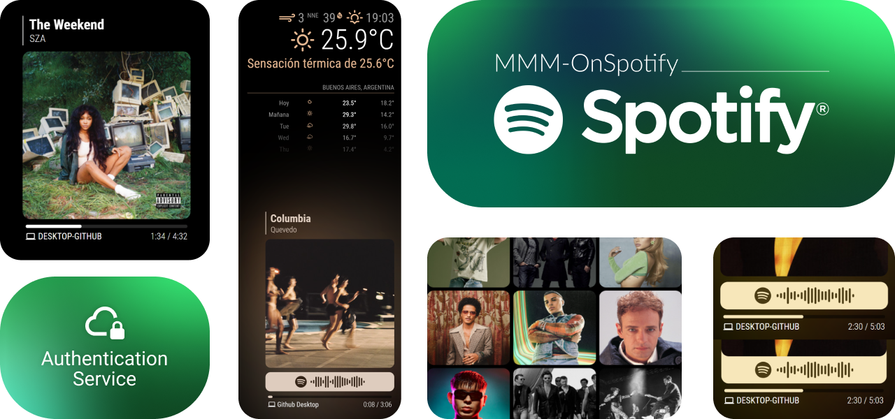
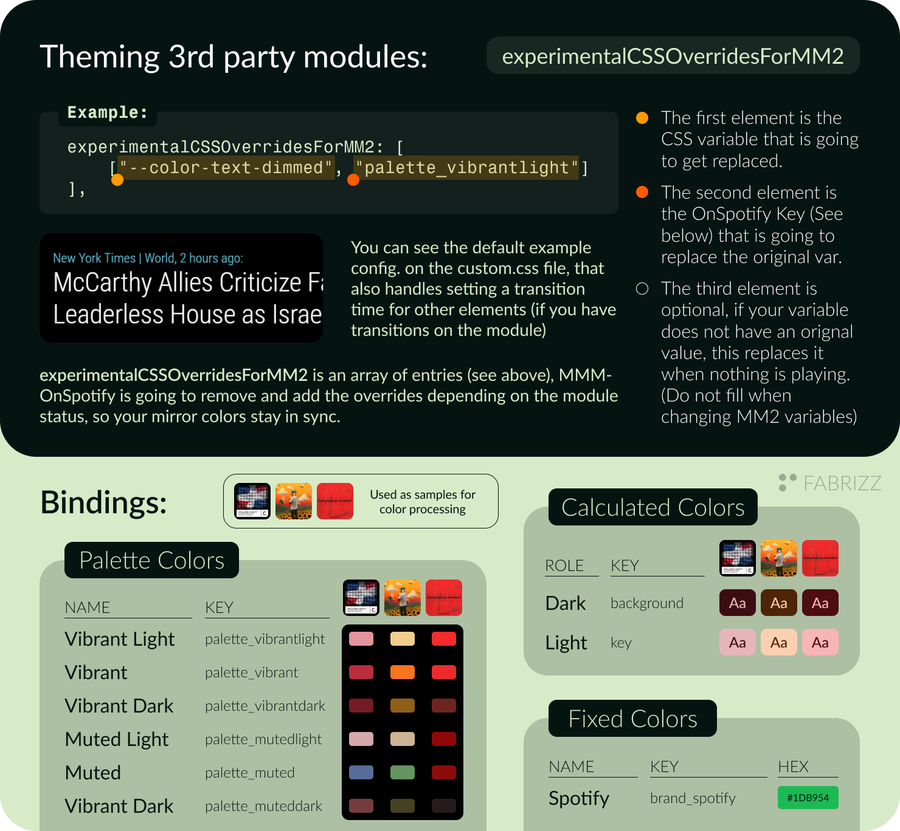
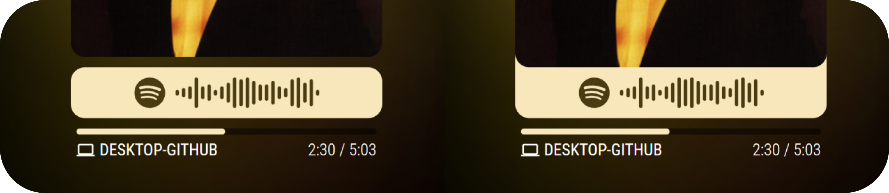
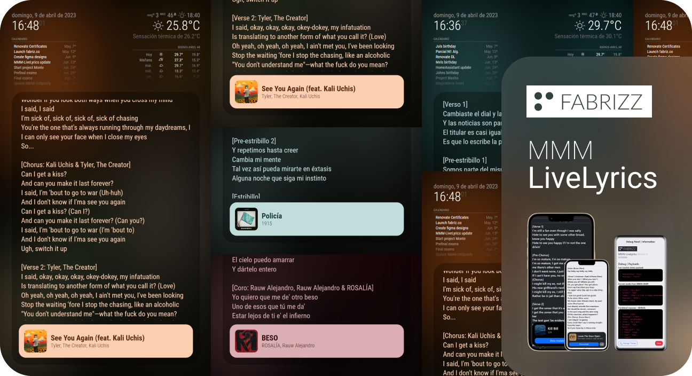

**MMM-OnSpotify** for MagicMirror² is a highly configurable module designed to display your current Spotify listening activity on your MagicMirror display (including podcasts, and when available, audiobooks). This module offers extensive customization options, allowing you to tailor the display to your preferences. It extracs the color data from the cover art and creates custom palettes to theme itself (and other modules!).

The module includes an Authentication Service that guide you through the configuration of an Spotify App. MMM-OnSpotify does not use any third party service, its an independent app, just the Spotify Web API.

> [!NOTE]
> All the data stays in your mirror. If you have multiple mirrors, the Authentication Service guides you on creating a new Spotify App per mirror.


https://github.com/Fabrizz/MMM-OnSpotify/assets/65259076/5d78672e-8feb-45de-92f4-ed44f0771432


# Installation
### Step 1: Clone the module and install dependencies
```bash
cd ~/MagicMirror/modules
git clone https://github.com/Fabrizz/MMM-OnSpotify.git
cd MMM-OnSpotify
npm install
```

### Step 2: Create a Spotify App and authorize the app

> [!WARNING]
> You can not use MMM-NowPlayingOnSpotify (or other module) credentials, as the API scopes are different.

To help you creating the Spotify App, we start the **Authentication Service**, that guides you on each step of the process:


```bash
npm run auth
> [Authorization Service] Open http://localhost:8100/ to configure your mirror. 
```
Once you finish, you are all set with the basic configuration. Scroll down to see all the different theming options for the module.

> When the Authorization Service is running, you can access it from your Raspberry Pi going to `http://localhost:8100/`. You can also access it remotely using `http://<IP>:8100/`. Note that using the device where you have Magic Mirror is recommended, as you are going to copy and paste the generated config entry.

# Module Configuration
#### The configuration section is divided in groups, scroll down or click what to see below:
### [[**NEW**] Theming 3rd Party Modules](#theming-3rd-party-modules) | [General](#general-options) | [Polling Intervals](#polling-intervals) | [Theming](#theming) | [**Lyrics**](#mmm-livelyrics) | [Dynamic Theme](#dynamic-theme)

**Extended full configuration object:**
```js
{
    module: "MMM-OnSpotify",
    position: "bottom_right",
    config: {
        // Spotify authentication (Authentication Service)
        clientID: "key",
        clientSecret: "key",
        accessToken: "key",
        refreshToken: "key",
        // General module options [SEE BELOW]
        advertisePlayerTheme: true,
        displayWhenEmpty: "both",
        userAffinityUseTracks: false,
        prefersLargeImageSize: false,
        hideTrackLenghtAndAnimateProgress: false,
        showDebugPalette: false,
        userDataMaxAge: 14400,
        userAffinityMaxAge: 36000,
        deviceFilter: [],
        deviceFilterExclude: false,
        filterNoticeSubtitle: true,
        language: config.language,
        // Update intervals [SEE BELOW]
        isPlaying: 1,
        isEmpty: 2,
        isPlayingHidden: 2,
        isEmptyHidden: 4,
        onReconnecting: 4,
        onError: 8,
        // Animations [SEE BELOW]
        mediaAnimations: false,
        fadeAnimations: false,
        textAnimations: true,
        transitionAnimations: true,
        // Spotify Code (EXPERMIENTAL)
        spotifyCodeExperimentalShow: true,
        spotifyCodeExperimentalUseColor: true,
        spotifyCodeExperimentalSeparateItem: true,
        // Theming General
        roundMediaCorners: true,
        roundProgressBar: true,
        showVerticalPipe: true, 
        useColorInProgressBar: true,
        useColorInTitle: true,
        useColorInUserData: true,
        showBlurBackground: true,
        blurCorrectionInFrameSide: false,
        blurCorrectionInAllSides: false,
        alwaysUseDefaultDeviceIcon: false,
        experimentalCSSOverridesForMM2: false, // [SEE BELOW]
    },
},
```

## Theming 3rd Party Modules: 


```js
/* Keys */
text background palette_vibrant palette_vibrantlight palette_vibrantdark palette_muted palette_mutedlight palette_muteddark brand_spotify
```
```js
/* Example */
experimentalCSSOverridesForMM2: [
	["--color-text-dimmed", "palette_vibrantlight"],
	["--ONSP-OVERRIDES-ICONS-COLOR", "palette_vibrantlight"], /* View custom.css */
],
```
> [!TIP]
> You can use other variables that are not from OnSpotify, just replace `palette_vibrantlight` with whatever variable you like, it gets wrapped on a `var(x)` function automatically.

### General options: 
| Key | Description |
| :-- | :-- |
| advertisePlayerTheme <br> `true` | If the module should send notifications when the theme status changes. |
| displayWhenEmpty <br> `"both"` | What to display when the player is empty. Options are: <br />- `user`: Displays user card <br />- `affinity`: Shows user top albums/songs <br />- `both`: Combines the user card and affinity data <br />- `logo`: Displays the Spotify logo <br />- `none`: Display only when playing<br /><br /> |
| userAffinityUseTracks <br> `false` | If you have selected to show your affinity data on idle, you can choose between showing tracks or albums. |
| prefersLargeImageSize <br> `false` | If you prefer to use higher resolution images. Not recommended for normal use. |
| hideTrackLenghtAndAnimateProgress <br> `false` | Depending on your internet conection or your selected polling rate, you may want to hide the actual seconds and animate the progress bar. |
| showDebugPalette <br> `false` | Shows the Vibrant output as a palette in the web console. <br /><br />  |
| userDataMaxAge <br> `14400` | (Seconds) The time in seconds of user data TTL. If set to 0, its updated everytime that the player goes to idle, as user data rarely changes, this allows a middle ground between updating always and only on boot |
| userAffinityMaxAge <br> `36000` | (Seconds) The time in seconds of affinity data TTL. If set to 0, its updated everytime that the player goes to idle, as user data rarely changes, this allows a middle ground between updating always and only on boot  |
| deviceFilter <br> `list[]` | List of device names to filter from the module, by default, its an inclusion list, you can change this using `deviceFilterExclude` (making it an exclusion list). When a filtered device plays `displayWhenEmpty` shows. Example: `["Sonos Bedroom", "DESKTOP-ABCD123"]` |
| deviceFilterExclude <br> `false` | Inverts the `deviceFilter` list, making it exclude devices |
| filterNoticeSubtitle <br> `true`| Changes the subtitle of `displayWhenEmpty`, to not show a false status if the `deviceFilter` is set |
| language <br> `config.language`| Changes the language in which titles of songs are shown. When it is not set, it depends on `config.language`. Example: `en-US` (Or `false` if you prefer the default api response) |

### Polling Intervals:
| Key | Description |
| :-- | :-- |
| isPlaying <br> `1` | Default interval when something is playing in Spotify. |
| isEmpty <br> `2` | Interval when the player is idle. | 
| isPlayingHidden <br> `2` | Interval when the module is hidden from another module and there is something playing in Spotify. |
| isEmptyHidden <br> `3` | Interval when the module is hidden and the player is idle. |
| onReconnecting <br> `4` | Interval when there is an error fetching from the Spotify API. |
| onError <br> `8` | After trying to reconnect for a long time, the module enters an error state where the polling is rate is longer than "onReconnecting". |

### Theming:
> See also: [Disabling **all** color based theming](#other)

> [!IMPORTANT]
> - If you are using a **RPI5** Not tested, any insight is helpful!
> - If you are using a **RPI4** I recommend to keep the default theming settings. (enabling some animations should not be a problem)
> - If you are using a **RPI3** or below, I recommend turning off the animations and the blurred background, as its GPU intensive.
> - If you using a **higher power device** (**RPI5**), you can turn on all the animations, the fade, text and transition animations look really good! 

| Key |  Description |
| :-- | :-- |
| spotifyCodeExperimentalShow <br> `true` | Shows the Spotify Code (SpotifyScannable) for the current Song/Podcast/Audiobook. This is an experimental feature, as the API is not documented. SVG elements from the Spotify CDN are sanitized and parsed to allow animations (`spotifyVectorAnimations`). <br /><br /> |
| spotifyCodeExperimentalUseColor <br> `true` | As shown on the image above, color the Spotify Code bar using cover art colors. |
| spotifyCodeExperimentalSeparateItem <br> `true` | Separates or joins the Spotify Code Bar to the cover art. Also respects `roundMediaCorners` and `spotifyCodeExperimentalUseColor`. <br /><br />  |
| mediaAnimations <br> `false` | Control the cover crossfade, this animation type waits for the image to be dowmloaded to do the fade between new/old media. (See the warning for RPIs above) |
| fadeAnimations <br> `false` | Controls the fade effects between module status changes. Not too GPU intensive. (See the warning for RPIs above) |
| scrollAnimations <br> `false` | Controls text scrolling for long music/podcast names/artist/show. (See the warning for RPIs above) |
| transitionAnimations <br> `true` | Controls the transition between color changes, GPU intensive, but looks really good. (See the warning for RPIs above) (It also affects other modules if you are using `experimentalCSSOverridesForMM2` default CSS config.) |
| textAnimations <br> `true` | Control the animation of text on music/podcast change, also affects the "current device" text. (See the warning for RPIs above) |
| spotifyVectorAnimations <br> `false` | Control the animation of the Spotify code, It look really good, as it transitions seamless. (See the warning for RPIs above) |
| roundMediaCorners <br> `true` | If cover art (and Spotify Code) should have rounded corners. |
| roundProgressBar <br> `true` | If you want a rounded progress bar. |
| showVerticalPipe <br> `true` | Shows or hides the vertical bar (or pipe) in the module header. |
| useColorInProgressBar <br> `true` | Use color in the progress bar. If `showBlurBackground` is enabled, the background behaviour differs to balance it. |
| useColorInTitle <br> `true` | Use color in the title, artist and bar. |
| useColorInUserData <br> `true` | Only when `displayWhenEmpty: "user"` is selected. |
| showBlurBackground <br> `true` | Renders the background for the module (Heavy GPU use). |
| blurCorrectionInFrameSide <br> `false` | Fixes the color blur in the frame side of the module, making it look like there is no gap between the actual border and the display. View ilustration below.<br /><br /> |
| blurCorrectionInAllSides <br> `false` | Same as `blurCorrectionInFrameSide`, but applies the correction on all of the borders for a more subtle effect. |
| alwaysUseDefaultDeviceIcon <br> `false` | The device icon changes depending on the player type. If you don’t like this behaviour you can disable it. |
| experimentalCSSOverridesForMM2 <br> `false` | An array containing CSS overrides, OnSpotify manages the status depending on what is displayed on the screen and lets you customize other modules. [See above](#theming-3rd-party-modules) |

## Dynamic Theme
> [!CAUTION]
> Using Dynamic Theming notifications is **deprecated**, use [CSS variables and overrides](#theming-3rd-party-modules).

The module sends the following notifications on status change:
```js
/* Playing     */ { provider: "MMM-OnSpotify", providerPrefix: "ONSP", providerScheme: "VIBRANT", set: "lock" }
/* Player idle */ { provider: "MMM-OnSpotify", set: "unlock" }
```
You can disable this behaviour using `advertisePlayerTheme: false`.

## MMM-LiveLyrics
View more on the [**MMM-LiveLyrics** repository](https://github.com/Fabrizz/MMM-LiveLyrics). This module uses web scrapping to get the Lyrics from Genius. Not recommended for basic usage.



## Notification API
| key | Description |
| :-- | :-- |
| `THEME_PREFERENCE` | ↑ **DEPRECATED**, from [Dynamic Theme](#dynamic-theme). |
| `NOW_PLAYING` | ↑ When the player state changes, the module sends a notification so other modules can, for example, [show lyrics](#lyrics). |
| `DEVICE_CHANGE` | ↑ Everytime the Spotify Connect target changes, this notification is fired. |
| `ONSPOTIFY_NOTICE` | ↑ This notification signals other modules that OnSpotify is available. |
| `ONSPOTIFY_GET` | ↓ Returns a **ONSPOTIFY_NOTICE** |
| `GET_PLAYING` | ↓ Return a **NOW_PLAYING** notification, regardles of the state of the player. (Used by [MMM-LiveLyrics](https://github.com/Fabrizz/MMM-LiveLyrics)) |

# Migrating from MMM-NowPlayingOnSpotify
You cannot migrate from NowPlayingInSpotify, as the scopes included in the NPOS auth do not enable searching for user data or viewing user generated data.

### Enabling every animation and the included CSS override:
```js
{
    module: "MMM-OnSpotify",
    position: "bottom_right",
    config: {
        clientID: "key",
        clientSecret: "key",
        accessToken: "key",
        refreshToken: "key",
	
	mediaAnimations: true,
	fadeAnimations: true,
	textAnimations: true,
	transitionAnimations: true,
	spotifyVectorAnimations: true,
        experimentalCSSOverridesForMM2: [
			["--color-text-dimmed", "palette_vibrantlight"],
			["--ONSP-OVERRIDES-ICONS-COLOR", "palette_vibrantlight"],
		],
    },
},
```

# Other:
- You can disable all the color related theming and use the module as is. You need to disable all the color related fields: <br />`advertisePlayerTheme`, `useColorInProgressBar`, `useColorInTitle`, `useColorInTitleBorder`, `showBlurBackground`, `useColorInUserData`, `spotifyCodeExperimentalUseColor`, `experimentalCSSOverridesForMM2`. Of course you can still use the Spotify Code (White/Gray). Disabling all theming options also stop the module from loading the [Vibrant](/vendor) lib.

- The API for Spotify Codes is not public, as its part of the Spotify CDN (_scannables.scdn.co_). The API could change without notice. Many libraries rely on it and using it does not go againts the ToS.

- Contributions wanted! Add features or your languaje using `translations/yourLanguaje.json`. Currently we have translations for: Spanish, English, German

With <3 by Fabrizio | [fabriz.co](https://fabriz.co/) | Star this repository! 
[](https://fabriz.co/)
