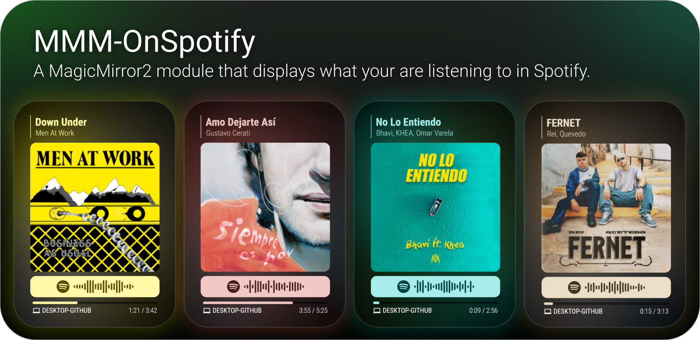
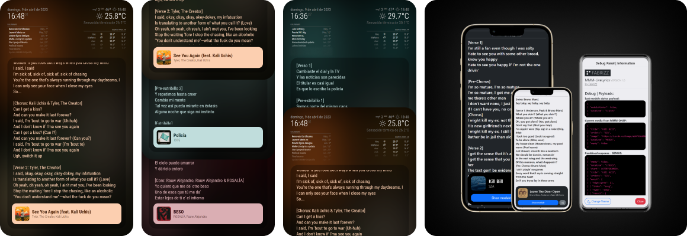
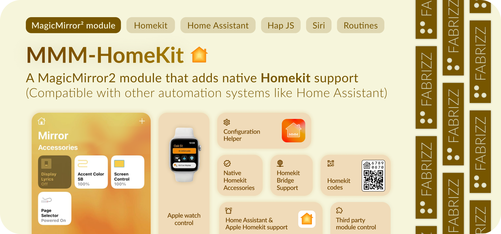

**MMM-OnSpotify** for MagicMirror² is a highly configurable module that displays Spotify activity on your MagicMirror display (including podcasts, and when available, audiobooks).

The module includes a web service that will guide you through the set up and configuration of the Spotify App and module. MMM-OnSpotify does not use any third party service, just the Spotify Web API.

https://github.com/Fabrizz/MMM-OnSpotify/assets/65259076/5d78672e-8feb-45de-92f4-ed44f0771432

https://github.com/Fabrizz/MMM-OnSpotify/assets/65259076/f7c0928f-3806-48ba-a813-87962dd9ea8b

> This module displays Spotify activity. If you want to use Spotify in your mirror you should look at [Raspotify](https://github.com/dtcooper/raspotify)

# Installation
### Step 1: Clone the module and install dependencies
```bash
cd ~/MagicMirror/modules
git clone https://github.com/Fabrizz/MMM-OnSpotify.git
cd MMM-OnSpotify
npm install
```

### Step 2: Create a Spotify App and authorize the app

> [!WARNING]
> You cannot use MMM-NowPlayingOnSpotify (or other module) credentials, the API scopes are different.

The module includes a web service that guides you in the creation fo the Spotify App, to use it (inside your module folder) run:


```bash
npm run auth
> [Authorization Service] Open http://localhost:8100/ to configure your mirror. 
```
Once you finish, you are all set with the basic configuration. Scroll down to see all the different theming options for the module.

> Once the Authorization Service is running, you can access it from the same device where you ran the command by going to `http://localhost:8100/`. You can clone the module on another device to use the service and copy the resulting config snippet to the desired MM².

# Updating
```bash
git pull
npm install
```

# Module Configuration

**Extended full configuration object:**
Do not copy everything! Just what you want to change. Below are the defaults:

```js
{
    module: "MMM-OnSpotify",
    position: "bottom_right",
    config: {
        // Spotify Auth
        clientID: "key",
        clientSecret: "key",
        accessToken: "key",
        refreshToken: "key",

        // General Options [SEE BELOW]
        advertisePlayerTheme: true,
        displayWhenEmpty: "both",
        userAffinityUseTracks: false,
        prefersLargeImageSize: false,
        hideTrackLengthAndAnimateProgress: false,
        showDebugPalette: false,
        userDataMaxAge: 14400,
        userAffinityMaxAge: 36000,
        deviceFilter: [],
        deviceFilterExclude: false,
        filterNoticeSubtitle: true,
        // language: config.language, // [SEE BELOW]

        // Update Intervals [SEE BELOW]
        isPlaying: 1,
        isEmpty: 2,
        isPlayingHidden: 2,
        isEmptyHidden: 4,
        onReconnecting: 4,
        onError: 8,

        // Animations [SEE BELOW]
        mediaAnimations: false,
        fadeAnimations: false,
        scrollAnimations: false,
        textAnimations: true,
        transitionAnimations: true,
        spotifyVectorAnimations: false,

        // Spotify Code [SEE BELOW]
        spotifyCodeExperimentalShow: true,
        spotifyCodeExperimentalUseColor: true,
        spotifyCodeExperimentalSeparateItem: true,

        // Canvas Videos [SEE BELOW]
        experimentalCanvas: false,
        experimentalCanvasEffect: 'cover',
        experimentalCanvasAlbumOverlay: false,
        experimentalCanvasSPDCookie: "",

        // Theming General [SEE BELOW]
        roundMediaCorners: true,
        roundProgressBar: true,
        showVerticalPipe: true, 
        useColorInProgressBar: true,
        useColorInTitle: true,
        useColorInUserData: true,
        showBlurBackground: true,
        blurCorrectionInFrameSide: false,
        blurCorrectionInAllSides: false,
        alwaysUseDefaultDeviceIcon: false,
        experimentalCSSOverridesForMM2: false, // [SEE BELOW]
        experimentalColorSignaling: false,
    },
},
```

### Theming 3rd Party Modules: 


```js
/* Keys */
text background palette_vibrant palette_vibrantlight palette_vibrantdark palette_muted palette_mutedlight palette_muteddark brand_spotify
```
```js
/* Example */
experimentalCSSOverridesForMM2: [
	["--color-text-dimmed", "palette_vibrantlight"],
	["--ONSP-OVERRIDES-ICONS-COLOR", "palette_vibrantlight"], /* View css/theming.css */
],
```
> [!TIP]
> You can use other variables that are not from OnSpotify, just replace `palette_vibrantlight` with whatever variable you like, it gets wrapped on a `var(x)` function automatically.

### General options: 
| Key | Description |
| :-- | :-- |
| advertisePlayerTheme <br> `true` | If the module should send notifications when the theme status changes. |
| displayWhenEmpty <br> `"both"` | What to display when the player is empty. Options are: <br />- `user`: Displays user card <br />- `affinity`: Shows user top albums/songs <br />- `both`: Combines the user card and affinity data <br />- `logo`: Displays the Spotify logo <br />- `none`: Display only when playing<br /><br /> |
| userAffinityUseTracks <br> `false` | If you have selected to show your affinity data on idle, you can choose between showing tracks or albums. |
| prefersLargeImageSize <br> `false` | If you prefer to use higher resolution images. Not recommended for normal use. |
| hideTrackLengthAndAnimateProgress <br> `false` | Depending on your internet conection or your selected polling rate, you may want to hide the actual seconds and animate the progress bar. |
| showDebugPalette <br> `false` | Shows the Vibrant output as a palette in the web console. <br /><br />  |
| userDataMaxAge <br> `14400` | (Seconds) The time in seconds of user data TTL. If set to 0, its updated everytime that the player goes to idle, as user data rarely changes, this allows a middle ground between updating always and only on boot |
| userAffinityMaxAge <br> `36000` | (Seconds) The time in seconds of affinity data TTL. If set to 0, its updated everytime that the player goes to idle, as user data rarely changes, this allows a middle ground between updating always and only on boot  |
| deviceFilter <br> `list[]` | List of device names to filter from the module, by default, its an inclusion list, you can change this using `deviceFilterExclude` (making it an exclusion list). When a filtered device plays `displayWhenEmpty` shows. Example: `["Sonos Bedroom", "DESKTOP-ABCD123"]` |
| deviceFilterExclude <br> `false` | Inverts the `deviceFilter` list, making it exclude devices |
| filterNoticeSubtitle <br> `true`| Changes the subtitle of `displayWhenEmpty`, to not show a false status if the `deviceFilter` is set |
| language <br> `config.language`| The language used in the API query. When it is not set, it depends on `config.language`. Example: `en-US` (Or `false` if you prefer the default api response) |

### Polling Intervals:
| Key | Description |
| :-- | :-- |
| isPlaying <br> `1` | Default interval when something is playing in Spotify. |
| isEmpty <br> `2` | Interval when the player is idle. | 
| isPlayingHidden <br> `2` | Interval when the module is hidden from another module and there is something playing in Spotify. |
| isEmptyHidden <br> `3` | Interval when the module is hidden and the player is idle. |
| onReconnecting <br> `4` | Interval when there is an error fetching from the Spotify API. |
| onError <br> `8` | After trying to reconnect for a long time, the module enters an error state where the polling is rate is longer than "onReconnecting". |

### Theming:
> See also: [Disabling **all** color based theming](#other)

> [!IMPORTANT]
> - If you are using a **RPI5** Not tested, any insight is helpful!
> - If you are using a **RPI4** I recommend to keep the default theming settings. (enabling some animations should not be a problem)
> - If you are using a **RPI3** or below, I recommend turning off the animations and the blurred background, as its GPU intensive.
> - If you using a **higher power device** (**RPI5**), you can turn on all the animations, the fade, text and transition animations look really good! 

#### Animations
| Key |  Description |
| :-- | :-- |
| mediaAnimations <br> `false` | Control the cover crossfade, this animation type waits for the image to be dowmloaded to do the fade between new/old media. (See the warning for RPIs above) |
| fadeAnimations <br> `false` | Controls the fade effects between module status changes. Not too GPU intensive. (See the warning for RPIs above) |
| scrollAnimations <br> `false` | Controls text scrolling for long music/podcast names/artist/show. (See the warning for RPIs above) |
| textAnimations <br> `true` | Control the animation of text on music/podcast change, also affects the "current device" text. (See the warning for RPIs above) |
| transitionAnimations <br> `true` | Controls the transition between color changes, GPU intensive, but looks really good. (See the warning for RPIs above) (It also affects other modules if you are using `experimentalCSSOverridesForMM2` default CSS config.) |
| spotifyVectorAnimations <br> `false` | Control the animation of the Spotify code, It look really good, as it transitions seamless. (See the warning for RPIs above) |

#### Spotify Code
| Key |  Description |
| :-- | :-- |
| spotifyCodeExperimentalShow <br> `true` | Shows the Spotify Code (SpotifyScannable) for the current Song/Podcast/Audiobook. This is an experimental feature, as the API is not documented. SVG elements from the Spotify CDN are sanitized and parsed to allow animations (`spotifyVectorAnimations`). <br /><br /> |
| spotifyCodeExperimentalUseColor <br> `true` | As shown on the image above, color the Spotify Code bar using cover art colors. |
| spotifyCodeExperimentalSeparateItem <br> `true` | Separates or joins the Spotify Code Bar to the cover art. Also respects `roundMediaCorners` and `spotifyCodeExperimentalUseColor`. <br /><br />  |

#### Canvas
> [!IMPORTANT]
> EXPERIMENTAL - Using this without auth will get this funtion rate-limited. For that you can add a `experimentalCanvasSPDCookie`. This is more advanced as it requieres you to get the cookie from a Spotify Web session. Not recommended for all users. 

> [!CAUTION]
> Canvases are an internal implementation by the Spotify team and its not available in the web API. Use at your own discretion, personal usage only.

| Key |  Description |
| :-- | :-- |
| experimentalCanvas <br> `false` | Shows the Spotify Canvas if available. This is an experimental feature, as this API is not documented and private. |
| experimentalCanvasAlbumOverlay <br> `true` | Show the cover art inside the Spotify Canvas. |
| experimentalCanvasEffect <br> `cover` | Control how is the canvas is going to be displayed. Options are: <br />- `cover`: The Canvas is clipped to have the same height as the album cover. Recommended for low-power devices and if the module is not in a `bottom_*` position. <br />- `scale`: Scale up/down the module to fit the entire Canvas without clipping it. <br /> |
| experimentalCanvasSPDCookie <br> `""` | Adds the SPD cookie from a web Spotify session to stop Spotify from returning a 500 error. Spotify could decide also to just send a 500 error depending on the user agents and other factors, this just affects the module. Still, this feature is optional and this API is NOT public. You can search "Extract Spotify SPD cookie" in youtube/other to learn how to do this. **DO NOT** share this cookie!. |

#### General Theming options
| Key |  Description |
| :-- | :-- |
| roundMediaCorners <br> `true` | If cover art (and Spotify Code) should have rounded corners. |
| roundProgressBar <br> `true` | If you want a rounded progress bar. |
| showVerticalPipe <br> `true` | Shows or hides the vertical bar (or pipe) in the module header. |
| useColorInProgressBar <br> `true` | Use color in the progress bar. If `showBlurBackground` is enabled, the background behaviour differs to balance it. |
| useColorInTitle <br> `true` | Use color in the title, artist and bar. |
| useColorInUserData <br> `true` | Only when `displayWhenEmpty: "user"` is selected. |
| showBlurBackground <br> `true` | Renders the background for the module (Heavy GPU use). |
| blurCorrectionInFrameSide <br> `false` | Fixes the color blur in the frame side of the module, making it look like there is no gap between the actual border and the display. View ilustration below.<br /><br /> |
| blurCorrectionInAllSides <br> `false` | Same as `blurCorrectionInFrameSide`, but applies the correction on all of the borders for a more subtle effect. |
| alwaysUseDefaultDeviceIcon <br> `false` | The device icon changes depending on the player type. If you don’t like this behaviour you can disable it. |
| experimentalCSSOverridesForMM2 <br> `false` | An array containing CSS overrides, OnSpotify manages the status depending on what is displayed on the screen and lets you customize other modules. [See above](#theming-3rd-party-modules) |
| experimentalColorSignaling <br> `false` | Sends a notification with the color data for modules that are not DOM based and need the color when its already processed. |

> See also: [Disabling **all** color based theming](#other)

## MMM-LiveLyrics
View more on the [**MMM-LiveLyrics** repository](https://github.com/Fabrizz/MMM-LiveLyrics). This module uses web scrapping to get the Lyrics from Genius. Not recommended for basic usage.



## MMM-HomeKit
Control your mirror (and other modules) using Apple Homekit protocol! (Also compatible with HomeAssistant or other automation systems with simulated HK controllers)

#### >>> [MMM-HomeKit repository](https://github.com/Fabrizz/MMM-HomeKit) <<<
- Control your screen on/off, brightness
- Set the mirror accent color
- Turn on/off on-screen lyrics
- Send notifications
- **With native HK accessories**



> To learn how to use OnSpotify and HomeKit provided accent colors together, read the guide in the [MMM-HomeKit repository](https://github.com/Fabrizz/MMM-HomeKit).

## Notification API
| key | Description |
| :-- | :-- |
| `THEME_PREFERENCE` | ↑ Sent to signal other modules that color data is available. |
| `INSTANT_COLOR` | ↑ Sent to signal other modules that color data has been updated instantly, also sends the raw vibrant data, only when `experimentalColorSignaling` is turned on. |
| `NOW_PLAYING` | ↑ When the player state changes, the module sends a notification so other modules can, for example, [show lyrics](#lyrics). |
| `DEVICE_CHANGE` | ↑ Everytime the Spotify Connect target changes, this notification is fired. |
| `ONSPOTIFY_NOTICE` | ↑ This notification signals other modules that OnSpotify is available. |
| `ONSPOTIFY_GET` | ↓ Returns a **ONSPOTIFY_NOTICE** |
| `GET_PLAYING` | ↓ Return a **NOW_PLAYING** notification, regardles of the state of the player. (Used by [MMM-LiveLyrics](https://github.com/Fabrizz/MMM-LiveLyrics)) |

# Migrating from MMM-NowPlayingOnSpotify
You cannot migrate from NowPlayingInSpotify, as the scopes included in the NPOS auth do not enable searching for user data or viewing user generated data.

### Enabling every animation and the included CSS override:
```js
{
    module: "MMM-OnSpotify",
    position: "bottom_right",
    config: {
        clientID: "key",
        clientSecret: "key",
        accessToken: "key",
        refreshToken: "key",
	
	mediaAnimations: true,
	fadeAnimations: true,
	textAnimations: true,
	transitionAnimations: true,
	spotifyVectorAnimations: true,
    scrollAnimations: true,
        experimentalCSSOverridesForMM2: [
			["--color-text-dimmed", "palette_vibrantlight"],
			["--ONSP-OVERRIDES-ICONS-COLOR", "palette_vibrantlight"],
		],
    },
},
```

# Other:
> [!CAUTION]
> Using Dynamic Theming notifications is **deprecated**, use [CSS variables and overrides](#theming-3rd-party-modules).

- You can disable all the color related theming and use the module as is. You need to disable all the color related fields: <br />`advertisePlayerTheme`, `useColorInProgressBar`, `useColorInTitle`, `useColorInTitleBorder`, `showBlurBackground`, `useColorInUserData`, `spotifyCodeExperimentalUseColor`, `experimentalCSSOverridesForMM2`. Of course you can still use the Spotify Code (White/Gray). Disabling all theming options also stop the module from loading the [Vibrant](/vendor) lib.

- The API for Spotify Codes is not public, as its part of the Spotify CDN (_scannables.scdn.co_). The API could change without notice. Many libraries rely on it and using it does not go againts the ToS.

- Contributions wanted! Add features or your language using `translations/yourLanguage.json`. Currently we have translations for: Spanish, English, German

- You can custom CSS and functions in the "Issues" tab. For example https://github.com/Fabrizz/MMM-OnSpotify/issues/65 for changing the size and hiding other modules using ONSP state.

With <3 by Fabrizio | [fabriz.co](https://fabriz.co/) | Star this repository! 
[](https://fabriz.co/)
